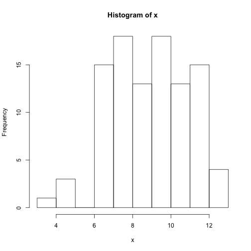
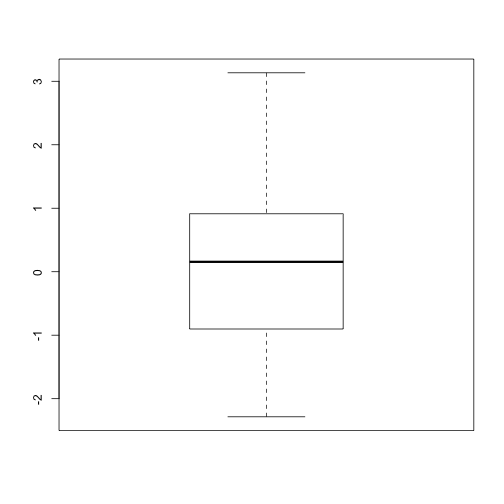

<script type="text/javascript"> 
var student_answers = {};
var comments = {missing:"Missing answer", correct:"Correct", incorrect:"Incorrect"};
var student_id = "{{{STUDENT_ID}}}";
var page_id = "{{{PAGE_ID}}}";
</script>

<link href="http://twitter.github.com/bootstrap/assets/css/bootstrap.css" rel="stylesheet">
<link href="http://twitter.github.com/bootstrap/assets/css/bootstrap-responsive.css" rel="stylesheet">
<script src="https://ajax.googleapis.com/ajax/libs/jquery/1.7.2/jquery.min.js" type="text/javascript"></script>
<script type="text/javascript" src="http://platform.twitter.com/widgets.js"></script> 
<script src="http://cdnjs.cloudflare.com/ajax/libs/twitter-bootstrap/2.0.3/bootstrap.min.js"></script>
<script src="http://twitter.github.com/bootstrap/assets/js/bootstrap-tooltip.js"></script>
<script src="http://twitter.github.com/bootstrap/assets/js/bootstrap-popover.js"></script>
<script src="http://twitter.github.com/bootstrap/assets/js/bootstrap-modal.js"></script>
<script src="http://twitter.github.com/bootstrap/assets/js/bootstrap-button.js"></script>
<script src="http://twitter.github.com/bootstrap/assets/js/bootstrap-typeahead.js"></script>
<script src="http://twitter.github.com/bootstrap/assets/js/bootstrap-tab.js"></script>
<script src="http://twitter.github.com/bootstrap/assets/js/bootstrap-scrollspy.js"></script>
<div id='main_message'></div>

<header class="jumbotron subhead"><h1>Writing a project</h1><p class='lead'>Writing a project</p></header>

<span><div id="navbar" class="navbar  navbar-fixed-top"><div class="navbar-inner"><ul id="navbar-header" class="nav"></ul></div></div></span><span id="subnav"></span>


<script>$('#navbar-header').append("<li><a href='#nav1' target='_self'>About</a></li>");</script>
<span><div id="nav1"></div></span>
<span><div class='page-header'><h2>About</h2></div></span>

The `questionr` package allows one to write projects containing
questions that can be self grading or graded by an instructor. The
projects display as one long web page with the possibility of a top
navigation bar to aid in navigation.

Self-grading questions can be written to 

* have a hint

* give comments on incorrect answers

* have a badge to record the number of tries a student makes per question.


<script>$('#navbar-header').append("<li><a href='#nav2' target='_self'>The basic template</a></li>");</script>
<span><div id="nav2"></div></span>
<span><div class='page-header'><h2>The basic template</h2></div></span>

The markup is done using `R-markdown`. The package requires some minimal header and footer content. The most minimal would be to put the following lines in an `AsIs` header:

<pre>
&#96;&#96;&#96;{r echo=FALSE, results="asis"}
## Nothing to see here ... move along
require("questionr", quietly=TRUE)
page <- questionr:::Page$new()
cat(page$write_header())
&#96;&#96;&#96;
</pre>


and have the following minimal footer:

<pre>
&#96;r I(page$write_footer())&#96;
</pre>

Pages are prettier with navigation, but that is not required.


<script>$('#navbar-header').append("<li><a href='#nav3' target='_self'>Question types</a></li>");</script>
<span><div id="nav3"></div></span>
<span><div class='page-header'><h2>Question types</h2></div></span>

There are several types of questions available:

<h3> Radio buttons </h3>

The `radio_choice` style allows a choice of one item from a list of
values. The basic markup would look like:


Pick a state:
<pre>
&#96;r I(page$radio_choice(state.name[1:4], "Alaska"))&#96;
&#96;r I(page$radio_choice(state.name[1:4], "Alaska"))&#96;
</pre>

which gives:

<form class="form-inline">
  <fieldset> 
    <div class="control-group">
      <label class="control-label"><span id='prob_1_badge' class='badge badge-info'>0 tries</span>&nbsp;New problem:</label>
      <div class="controls">
        <p id="prob_1_help" class="help-block"></p>
      </div>
    </div>
  </fieldset>
</form>


<fieldset><span id='prob_1'>
<label class='radio inline'><input type='radio' id='prob_1_1' class='prob_1XXX' name='prob_1' value='Alabama'>Alabama</label>
<label class='radio inline'><input type='radio' id='prob_1_2' class='prob_1XXX' name='prob_1' value='Alaska'>Alaska</label>
<label class='radio inline'><input type='radio' id='prob_1_3' class='prob_1XXX' name='prob_1' value='Arizona'>Arizona</label>
<label class='radio inline'><input type='radio' id='prob_1_4' class='prob_1XXX' name='prob_1' value='Arkansas'>Arkansas</label>
</span></fieldset>
<br/>

That's a little minimal. One can add a new problem indicator, a hint and comments on incorrect answers. For example:

<pre>
&#96;r I(page$new_problem())&#96;
Pick a really large state:
&#96;&#96;&#96;{r echo=FALSE, results="asis"}
cat(page$radio_choice(state.name[1:4], "Alaska", 
  hint="North to ...", 
  comment=list("Alabama"="Nope, that's Sweet home Alabama", 
               "Arizona"="Nope, the Grand Canyon State", 
               "Arkansas"="Nope that's the Natural State"), 
               linebreak=TRUE))
&#96;&#96;&#96;
</pre>

This yields


<form class="form-inline">
  <fieldset> 
    <div class="control-group">
      <label class="control-label"><span id='prob_2_badge' class='badge badge-info'>0 tries</span>&nbsp;New problem:</label>
      <div class="controls">
        <p id="prob_2_help" class="help-block"></p>
      </div>
    </div>
  </fieldset>
</form>

Pick a really large state:


<fieldset><span id='prob_2'>
<label class='radio inline'><input type='radio' id='prob_2_1' class='prob_2XXX' name='prob_2' value='Alabama'>Alabama</label>
<label class='radio inline'><input type='radio' id='prob_2_2' class='prob_2XXX' name='prob_2' value='Alaska'>Alaska</label>
<label class='radio inline'><input type='radio' id='prob_2_3' class='prob_2XXX' name='prob_2' value='Arizona'>Arizona</label>
<label class='radio inline'><input type='radio' id='prob_2_4' class='prob_2XXX' name='prob_2' value='Arkansas'>Arkansas</label>
</span></fieldset>
<br/>

<script>$('#prob_2').popover({title:'hint',content:'North to the future...'});</script>


The above example shows many things:

- the `new_problem` call will create a badge which records the number of tries and has a space for comments to be displayed. This is the default behaviour, but can be modified by calling with `add_badge=FALSE`. This default to the value of `instant_feedback` given to the `page` constructor.

- The `hint` argument allows one to give the students hints that popup on mouse overs

- The `comment` argument takes a named list where the names come from the incorrect answers and the values specify a comment.

- The problems are marked up inline wrapped with `I()` or in a block
  wrapped in `cat()`. Maybe this can be removed through some fancy
  `knitr` options, but it hasn't yet been done.


<h3>Checkbox groups</h3>

A checkgroup allows the student to select one _or more_ from a set of values. The basic markup looks like:

<pre>
&#96;r I(page$checkgroup_choice(state.name[1:4], c("Alabama", "Alaska")))&#96;
</pre>


yielding:


<fieldset id='prob_3_fieldset'><span id='prob_3'>
<label class='checkbox inline'><input type='checkbox' id='prob_3_1'  class='prob_3' name='prob_3' value='Alabama' />Alabama</label>
<label class='checkbox inline'><input type='checkbox' id='prob_3_2'  class='prob_3' name='prob_3' value='Alaska' />Alaska</label>
<label class='checkbox inline'><input type='checkbox' id='prob_3_3'  class='prob_3' name='prob_3' value='Arizona' />Arizona</label>
<label class='checkbox inline'><input type='checkbox' id='prob_3_4'  class='prob_3' name='prob_3' value='Arkansas' />Arkansas</label>
</span></fieldset>
<br/>

Comments are specified using values combined with "::". So for example

```r
comments <- list("Alabama::Arkansas"="Nope not right",
	         "Alabama"="Nope, one more")
```
The other combinations will get the default:


<form class="form-inline">
  <fieldset> 
    <div class="control-group">
      <label class="control-label"><span id='prob_4_badge' class='badge badge-info'>0 tries</span>&nbsp;New problem:</label>
      <div class="controls">
        <p id="prob_4_help" class="help-block"></p>
      </div>
    </div>
  </fieldset>
</form>


<fieldset id='prob_4_fieldset'><span id='prob_4'>
<label class='checkbox inline'><input type='checkbox' id='prob_4_1'  class='prob_4' name='prob_4' value='Alabama' />Alabama</label>
<label class='checkbox inline'><input type='checkbox' id='prob_4_2'  class='prob_4' name='prob_4' value='Alaska' />Alaska</label>
<label class='checkbox inline'><input type='checkbox' id='prob_4_3'  class='prob_4' name='prob_4' value='Arizona' />Arizona</label>
<label class='checkbox inline'><input type='checkbox' id='prob_4_4'  class='prob_4' name='prob_4' value='Arkansas' />Arkansas</label>
</span></fieldset>
<br/>


<h3>Typeahead choice</h3>

A typeahead choice forces the user to type in their answers, but allows them to narrow the list of potential answers. It is useful when there can be many.

For example, to select one of the 50 states:

<pre>
&#96;r I(page$typeahead_choice(state.name, "Alaska", hint="North to the future"))&#96;
</pre>


<form class="form-inline">
  <fieldset> 
    <div class="control-group">
      <label class="control-label"><span id='prob_5_badge' class='badge badge-info'>0 tries</span>&nbsp;New problem:</label>
      <div class="controls">
        <p id="prob_5_help" class="help-block"></p>
      </div>
    </div>
  </fieldset>
</form>

Enter a state:

<input type='text' class='typeahead disabled' data-provide='typeahead' id='prob_5'>

<script>$('#prob_5').typeahead({source:[ "Alabama", "Alaska", "Arizona", "Arkansas", "California", "Colorado", "Connecticut", "Delaware", "Florida", "Georgia", "Hawaii", "Idaho", "Illinois", "Indiana", "Iowa", "Kansas", "Kentucky", "Louisiana", "Maine", "Maryland", "Massachusetts", "Michigan", "Minnesota", "Mississippi", "Missouri", "Montana", "Nebraska", "Nevada", "New Hampshire", "New Jersey", "New Mexico", "New York", "North Carolina", "North Dakota", "Ohio", "Oklahoma", "Oregon", "Pennsylvania", "Rhode Island", "South Carolina", "South Dakota", "Tennessee", "Texas", "Utah", "Vermont", "Virginia", "Washington", "West Virginia", "Wisconsin", "Wyoming" ]});</script>


<script>$('#prob_5').popover({title:'hint',content:'North to the future'});</script>


<h3>Combobox or select choice</h3>
The `combobox_choice` gives the student a combobox to choose an item from. It is very similar to a radio choice, but manages screen space differently.


<pre>
&#96;r I(page$new_problem())&#96;
Pick a really large state:
&#96;&#96;&#96;{r echo=FALSE, results="asis"}
cat(page$combobox_choice(state.name[1:4], "Alaska", 
  hint="North to the future...", 
  comment=list("Alabama"="Nope, that's Sweet home Alabama", 
               "Arizona"="Nope, the Grand Canyon State", 
               "Arkansas"="Nope, that's the Natural State")))
&#96;&#96;&#96;
</pre>


<form class="form-inline">
  <fieldset> 
    <div class="control-group">
      <label class="control-label"><span id='prob_6_badge' class='badge badge-info'>0 tries</span>&nbsp;New problem:</label>
      <div class="controls">
        <p id="prob_6_help" class="help-block"></p>
      </div>
    </div>
  </fieldset>
</form>

Pick a really large state:
<select class='combobox' id='prob_6'>

<option value=''>Select one ...</option>

<option value='Alabama'>Alabama</option>

<option value='Alaska'>Alaska</option>

<option value='Arizona'>Arizona</option>

<option value='Arkansas'>Arkansas</option>


</select>


<script>$('#prob_6').popover({title:'hint',content:'North to the future...'});</script>


<h3>Numeric choices</h3>
A numeric choice allows the student to enter a number. To work around rounding issues, the problem can be set with a min and maximum allowable value. The comment list has names `less` and `more`. Here is a way to get $\pi$:


<pre>
&#96;r I(page$new_problem())&#96;
What is $\pi$?
&#96;&#96;&#96;{r echo=FALSE, results="asis"}
cat(page$numeric_choice(3.1, 3.2, 
  comment=list(more="Too much", less="Too little")))
&#96;&#96;&#96;
</pre>


<form class="form-inline">
  <fieldset> 
    <div class="control-group">
      <label class="control-label"><span id='prob_7_badge' class='badge badge-info'>0 tries</span>&nbsp;New problem:</label>
      <div class="controls">
        <p id="prob_7_help" class="help-block"></p>
      </div>
    </div>
  </fieldset>
</form>

What is $\pi$?

<input type='text' class='numeric_answer' id='prob_7'>


<h3>Free response</h3>

The `free_choice` option allows a student to enter in any text into a text box. The only option is a hint. These problems are not graded automatically, rather by the teacher of a section. While grading the text can be run through R-markdown.


<pre>
&#96;&#96;&#96;{r echo=FALSE, results="asis"}
cat(page$new_problem())
cat(page$write("Well, how do you feel?"))
cat(page$free_choice("Go ahead, enter whatever you want..."))
&#96;&#96;&#96;
</pre>


<form class="form-inline">
  <fieldset> 
    <div class="control-group">
      <label class="control-label"><span id='prob_8_badge' class='badge badge-info'>0 tries</span>&nbsp;New problem:</label>
      <div class="controls">
        <p id="prob_8_help" class="help-block"></p>
      </div>
    </div>
  </fieldset>
</form>
<br/>Well, how do you feel?<br/>Well, how do you feel?

<textarea class="free input-xlarge" id="prob_8" rows=4 cols=80></textarea>


<script>$('#prob_8').popover({title:'hint',content:'Go ahead, enter whatever you want...'});</script>


<script>$('#navbar-header').append("<li><a href='#nav4' target='_self'>Randomization</a></li>");</script>
<span><div id="nav4"></div></span>
<span><div class='page-header'><h2>Randomization</h2></div></span>

Problems can be radomized. Each student has their own random seed, and
each project is generated with that seed. So different students will
(likely) get different projects, but the same student should always
get the same one. With this, problems can be randomized. For example, this problem asks a student to estimate the mean from a histogram:

<pre>
&#96;&#96;&#96;{r echo=FALSE, results="asis"}
mu <- sample(1:10, 1); sigma=sample(1:3, 1)
x <- rnorm(100, mu, sigma)
cat(page$new_problem())
hist(x)
page$write("Guess the mean from the histogram")
cat(page$numeric_choice(mu-sigma/2, mu + sigma/2))
&#96;&#96;&#96;
</pre>


<form class="form-inline">
  <fieldset> 
    <div class="control-group">
      <label class="control-label"><span id='prob_9_badge' class='badge badge-info'>0 tries</span>&nbsp;New problem:</label>
      <div class="controls">
        <p id="prob_9_help" class="help-block"></p>
      </div>
    </div>
  </fieldset>
</form>
 <br/>Guess the mean from the histogram<br/>Guess the mean from the histogram

<input type='text' class='numeric_answer' id='prob_9'>


<script>$('#navbar-header').append("<li><a href='#nav5' target='_self'>Navigation</a></li>");</script>
<span><div id="nav5"></div></span>
<span><div class='page-header'><h2>Navigation</h2></div></span>

The basic page has no navigation features. Adding them is easy. We create an `nav` object in the header with:

<pre>
&#96;&#96;&#96; {r echo=FALSE, results="asis"}
## Nothing to see here ... move along
require("questionr", quietly=TRUE)
page <- questionr:::Page$new()
nav <- questionr:::NavBar$new()
cat(page$write_header())
&#96;&#96;&#96;
</pre>

Then when we want to add navigation (which consists of an item in the menu bar and a heading in the file, we use the `add` method:

<pre>
&#96;r I(nav$add("Some navigation"))&#96;
</pre>

To finish navigation we call the `write_footer` method. This is usually just part of the footer along with a call to the `write_footer` method of the page object.


<script>$('#navbar-header').append("<li><a href='#nav6' target='_self'>Tabs</a></li>");</script>
<span><div id="nav6"></div></span>
<span><div class='page-header'><h2>Tabs</h2></div></span>

One can add a notebook with tabs to compress the necessary vertical space. This is useful for grouping related items together in a question, such as diagnostic graphics. The tab container is made with the `Tabs` reference class and new pages added with the `add` method. All tabs are wrapped in a `write_header` and `write_footer`. For example, this code:

<pre>
&#96;&#96;&#96;{r echo=FALSE, results="asis"}
tabs <- questionr:::Tabs$new()
cat(tabs$write_header())

x <- rnorm(100)
&#96;&#96;&#96;

&#96;r I(tabs$add("Summary"))&#96;
&#96;&#96;&#96;{r}
summary(x)
&#96;&#96;&#96;
&#96;r I(tabs$add("boxplot"))&#96;
&#96;&#96;&#96;{r}
boxplot(x)
&#96;&#96;&#96;

&#96;r I(tabs$write_footer())&#96;

</pre>

makes these tabs:

<ul id='IQWPLFZISW' class='nav nav-tabs'></ul>
<span><div class="tab-content">


<script>$('#IQWPLFZISW').append("<li><a href='#tab_no_IQWPLFZISW_1'  data-toggle='tab'>Summary</a></li>");</script>
<span><div id="tab_no_IQWPLFZISW_1" class="tab-pane">


```r
summary(x)
```


```
##    Min. 1st Qu.  Median    Mean 3rd Qu.    Max. 
##  -2.290  -0.902   0.156   0.061   0.911   3.130 
```


</div></span>

<script>$('#IQWPLFZISW').append("<li><a href='#tab_no_IQWPLFZISW_2'  data-toggle='tab'>boxplot</a></li>");</script>
<span><div id="tab_no_IQWPLFZISW_2" class="tab-pane">


```r
boxplot(x)
```

 


</div></span>
</div></span>
<hr/>


<script>$('#navbar-header').append("<li><a href='#nav7' target='_self'>Deploying</a></li>");</script>
<span><div id="nav7"></div></span>
<span><div class='page-header'><h2>Deploying</h2></div></span>

Once knit, pages are standalone, self grading web pages. The grading can happen instantly and the badges and comments give the necessary feedback. This is the default behaviour. For such pages, the HTML is self contained and can be hosted anywhere. For exampe Rpubs.

Pages can also be shown within the system provided by this package. For such use, one should add buttons near the bottom. The call for this is:

<pre>
&#96;r I(page$grade_button())&#96;
</pre>

To deploy these pages, a teacher must upload them into a class or section as projects.


<!--- Finish this off -->


<script>
$('body').css('margin', '40px 10px');
//$('body').attr('data-offset','40');
//$('body').attr('data-target','#subnav');
$('body').attr('data-spy','scroll');
//$('[data-spy="scroll"]').each(function () {
//   var $spy = $(this).scrollspy('refresh')
//});
</script>


<div id='grade_alert'></div>
<script>

var tmp = $(".nav-tabs")
$.each(tmp, function(key, value) {
  $("#" + value.id + " a:first").tab("show")
});
 
$("#navbar").scrollspy();
$("body").attr("data-spy", "scroll");
$("[data-spy=\'scroll\']").each(function () {
  var $spy = $(this).scrollspy("refresh")
});

function comment_default(grade, stud_ans, comment, def) {
    var cmt = "";
    if(grade == 100) {
	cmt = def.correct;
    } else if(typeof(comment) != "undefined") {
	if(typeof(comment[stud_ans]) != "undefined") {
	    cmt = comment[stud_ans];
	} else {
	    cmt = def.incorrect;
	}
    } else {
	cmt = def.incorrect;
    }
    return cmt;
};

function comment_checkgroup(grade, stud_ans, comment, def) {
    var tmp = []; 
    $.each(stud_ans, function(key, value) {if(value !== null) tmp.push(value)});
    return comment_default(grade, tmp.sort().join("::"), comment, def);
};

function comment_numeric(grade, stud_ans, value, comment, def) {
    var cmt = "";
    if(grade == 100) {
	cmt = def.correct;
    } else if(typeof(comment) != "undefined") {
	if(stud_ans < value[0]) {
	    if(typeof(comment.less) != "undefined") {
		cmt = comment.less
	    } else {
		cmt = def.incorrect
	    }
	} else if(stud_ans > value[1]) {
	    if(typeof(comment.more) != "undefined") {
		cmt = comment.more
	    } else {
		cmt = def.incorrect
	    }
	}
    } else {
	cmt = def.incorrect;
    }
    return cmt;
}
function grade_radio(ans, value) {return( ans == value ? 100 : 0) };
function grade_checkboxgroup(ans, value) {
  var out=[];
  $.each(ans, function(key, value) { if(value != null) { out.push(value) }});
  if(out.length != value.length) { return(0) };
  out = out.sort();
  var value = value.sort()
  for(var i=0; i < out.length; i++) {
    if(out[i] != value[i]) { return(0) }
  }
  return(100)
};
function grade_typeahead(ans, value) { return( (ans == value) ? 100 : 0 )};
function grade_combo(ans, value) { return( (ans == value) ? 100 : 0) };
function grade_numeric(ans, value) { return( (ans >= value[0] && ans <= value[1]) ? 100 : 0) };


function submit_work(status) {
    $.ajax({
	url:"/set_answers",
	type:"POST",
	data: {
	    answers:JSON.stringify(student_answers),
	    status:status,
	    project_id:page_id
	},
	success:function(data) {
	    window.location.replace("");
	}
    });
};

function set_radio(id, value) {
  $("#" + id + " [value=" + value + "]").attr("checked", true);
};

function set_checkboxgroup(id, value) {
  $("#" + id + " [type=checkbox]").attr("checked", false);
  $.each(value, function(idx, val) {
    $("#" + id + " [value=" + val + "]").attr("checked", true)
  })
};


function set_typeahead(id, value) {
    $("#" + id).val(value)
};

function set_combo(id, value) {
    if(value.length > 0) {
	$("#" + id + " [value=" + value + "]").attr("selected", true)
    } else {
	$("#" + id)[0].selectedIndex=0;
    }

};

function set_numeric(id, value) {
    $("#" + id).val(value)
};

function set_free(id, value) {
    $("#" + id).val(value);
};

function set_answer(o) {
    var id = o.problem; 
    var value = o.answer;
    var type = o.type
    if(type == "radio") {
	set_radio(id, value)
    } else if(type == "checkbox") {
	set_checkboxgroup(id, value)
    } else if(type == "typeahead") {
	set_typeahead(id, value)
    } else if(type == "combo") {
	set_combo(id, value)
    } else if(type == "numeric") {
	set_numeric(id, value)
    } else if(type == "free") {
	set_free(id, value)
    }
};

function set_answers(status, stud_ans) {
    $.each(stud_ans, function(key, value) {
	set_answer(value);
	if(typeof(value.comment) != "undefined") {
	    var cmt = '<div class="alert"><a class="close" data-dismiss="alert" href="#">×</a>' + value.comment + '</div>'
	    var x =  $("#" + value.problem + "_help");
	    if(x.length > 0) {
		x[0].innerHTML = cmt;
	    }
	    if(status == "graded") {
		var x =  $("#" + value.problem + "_comment");
		if(x.length > 0) {
		    x[0].innerHTML = cmt;
		}
	    }
	}
    });
};

var is_open=false;

function write_grade_table() {
    var a = student_answers;
    if(is_open) {
	$("#gradealert").alert('close');
    } else {
	$("#grade_alert").append('<div id = "fillmein"></div>');

	$("#fillmein").append('<div id="gradealert" class="alert alert-block fade in"><button class="close" data-dismiss="alert">×</button>');
	$("#gradealert").append('<h2>Congratulations, your scores so far are:</h2>');  
	$("#gradealert").append('<table id="grade_alert_table" class="table table-bordered table-striped">');
	$("#gradealert").append("</table></div>");
	
	$("#grade_alert_table").append('<thead><tr><th>Problem</th><th>Score</th><th>Comment</th></tr></thead><tbody>');

	var icon_lookup = {true:"icon-thumbs-up", false:"icon-thumbs-down", missing:"icon-warning-sign"};
	var msg_lookup = {true:"Correct", false: "Incorrect", missing:"Missing"};

	$.each(a, function() {
	    $("#grade_alert_table").append("<tr>" +
					   "<td>" + 
					   "<a class='grade_clicker' href='#" + this.problem + "' target='_self'>" +
					   "Problem " + this.problem.replace("prob_", "") + "</a></td>" +
					   " <td>" + 
					   "<i class='" + icon_lookup[this.grade] + "'></i>&nbsp;" +
					   msg_lookup[this.grade] + "</td>" +
					   "<td>" + this.comment + "</td>" +
					   "</tr>");
	})
	    $("#grade_alert_table").append('</tbody>');
	$(".grade_clicker").each(function() { this.onclick = function() {$("#gradealert").alert('close')}})
	    $("#gradealert").alert();
	is_open = true;
	$("#gradealert").bind("closed", function() {is_open=false});
    }
};
$(document).ready(function() {
    $(".btn").button()

    var cmt_defaults={correct:comments.correct, 
		      incorrect:comments.incorrect,
		      missing:comments.missing
		     };	
    var fix_badge = function(key, tries, answer, comment) {
	$('#' + key + "_badge").each(function() {this.innerHTML = tries + (tries == 1 ? " try" : " tries")});
	$.each(['badge-info', 'badge-warning', 'badge-success'], function(idx, value) {
	    $('#' + key + "_badge").removeClass(value)
	});
	if(answer == true) {
	    $('#' + key + "_badge").addClass("badge-success");
	} else {
	    $('#' + key + "_badge").addClass("badge-warning");
	};
	$('#' + key + "_help").each(function() {
	    this.innerHTML=
		"<div class='alert alert-info'><a class='close' data-dismiss='alert' href='#'>×</a>" + comment + "</div>";
	});
	
    }
    var close_comment = function(key) {
	$("#" + key + "_comment > .alert").alert("close");
    };
    $("[type=\'radio\']").each(function() {
	student_answers[this.name]={problem:this.name, type:'radio', tries:0};
	this.onchange = function() {
	    var key = this.name;
	    var sans = this.value;
	    var answer = grade_radio(sans, actual_answers[key].value);
	    var comment = comment_default(answer, sans, comments[key], cmt_defaults); 
	    var tries = student_answers[key].tries + 1;
	    student_answers[key] = {
		problem:key,
		type:'radio',
		tries:tries,
		answer:sans,
		grade:answer,
		comment:comment
	    };
	    fix_badge(key, tries, answer, comment);
	}
    }
			      );
    $("[type=\'checkbox\']").each(function() {
	var n = $("#" + this.name + "> .checkbox").length
	var ans = {};
	for(i=1; i <= n; i++) {ans[this.name + "_" + i] = null;}
	student_answers[this.name] = {
	    problem: this.name,
	    type:'checkbox',
	    tries:0,
	    answer:ans
	};
	this.onchange = function() {
	    var key = this.name;
	    var sans = student_answers[key].answer;
	    if(this.checked) {
		sans[this.id] = this.value;
	    } else {
		sans[this.id] = null;
	    }
	    var answer = grade_checkboxgroup(sans, actual_answers[key].value);
	    var comment = comment_checkgroup(answer, sans, comments[key], cmt_defaults); 
	    var tries = student_answers[key].tries + 1;

	    student_answers[key] = {
		problem:key,
		type:'checkbox',
		tries:tries,
		answer:sans,
		grade:answer,
		comment:comment
	    };
	    fix_badge(key, tries, answer, comment)
	}
    });
    $(".typeahead").each(function() {
	if(this.id.length > 0) {
	    student_answers[this.id]={problem:this.id, type:'typeahead',  tries:0};
	}
	this.onchange = function() {
	    var key = this.id;
	    var sans = this.value;
	    var answer = grade_typeahead(sans, actual_answers[key].value);
	    var comment = comment_default(answer, sans, comments[key], cmt_defaults); 
	    var tries = student_answers[key].tries + 1;

	    student_answers[key] = {
		problem:key,
		type:"typeahead",
		tries:student_answers[key].tries + 1,
		answer:sans,
		grade:answer,
		comment:comment
	    };
	    fix_badge(key, tries, answer, comment)
	}
    });
    
    $(".combobox").each(function() { 
	student_answers[this.id]={problem:this.id, type:'combo', tries:0};
	this.onchange = function() {
	    var key = this.id;
	    var sans = this.value;
	    var answer = grade_combo(sans, actual_answers[key].value);
	    var comment = comment_default(answer, sans, comments[key], cmt_defaults); 
	    var tries = student_answers[key].tries + 1;

	    student_answers[key] = {
		problem:key,
		type:"combo",
		tries:tries,
		answer:sans,
		grade:answer,
		comment:comment
	    };
	    fix_badge(key, tries, answer, comment)
	}
    });
    $(".numeric_answer").each(function() {
	student_answers[this.id]={problem:this.id, type:'numeric', tries:0};
	this.onchange = function() {
	    var key = this.id;
	    var sans = this.value;
	    var answer = grade_numeric(sans, actual_answers[key].value);
	    var comment = comment_numeric(answer, sans, 
					  actual_answers[key].value,
					  comments[key],
					  cmt_defaults); 
	    var tries = student_answers[key].tries + 1;

	    student_answers[key] = {
		problem:key,
		type:"numeric",
		tries:tries,
		answer:sans,
		grade:answer,
		comment:comment
	    };
	    fix_badge(key, tries, answer, comment)
	}
    });
    $(".free").each(function() {
	student_answers[this.id]={problem:this.id, type:'free', tries:0};
	this.onchange = function() {
	    var key = this.id;
	    var sans = this.value;
	    student_answers[key].answer = sans;
	};
    });

    var restore_badges = function(x) {
    $.each(x, function(key, value) {
	var badge = $("#" + key + "_badge");
	if(badge.length > 0) {
	    var tries = x[key].tries;
	    badge[0].innerHTML = tries + " tries"
	}
    })
}
    // get answers from server, restore
    $.ajax({
	url:"http://localhost:9000/custom/quizr/get_answers", 
	type:'POST',
	data:{ project_id:page_id}, 
	success:function(data, status, jqxhr) {
	   
	    if(data.status == "error") {
		return null;
	    }
	    
	    student_answers = data.answers;
	    set_answers(data.status, data.answers);
	    restore_badges(student_answers);

	    if(data.status == "graded") {
		// no more changes!
		$("button").addClass("disabled");
		$("button").each(function() {this.onclick=null});
		    
		$.each($('[id*="prob"]'), function() {this.onchange = null});
		$("input").attr("disabled", "disabled");
		$("select").attr("disabled", "disabled");
		
		$(".badge").each(function() {this.innerHTML = "graded"});

		$("#main_message").append('<div class="alert alert-block alert-info"><a class="close" data-dismiss="alert" href="#">×</a><b>This was already graded</b>, no more changes are possible.</div>');
	    }
	}
    });
});
</script>
<script>var actual_answers={ "prob_1": {
 "type": "radio",
"value": "Alaska" 
},"prob_2": {
 "type": "radio",
"value": "Alaska" 
},"prob_3": {
 "type": "checkgroup",
"value": [ "Alabama", "Alaska" ] 
},"prob_4": {
 "type": "checkgroup",
"value": [ "Alabama", "Alaska" ] 
},"prob_5": {
 "type": "typeahead",
"value": "Alaska" 
},"prob_6": {
 "type": "combobox",
"value": "Alaska" 
},"prob_7": {
 "type": "numeric",
"value": [    3.1,    3.2 ] 
},"prob_8": {
 "type": "free",
"value": "null" 
},"prob_9": {
 "type": "numeric",
"value": [      8,     10 ] 
} };</script>

<script>comments={ "missing": "Missing answer","correct": "Correct answer","incorrect": "Incorrect answer","prob_2": {
 "Alabama": "Nope, that's Sweet home Alabama",
"Arizona": "Nope, the Grand Canyon State",
"Arkansas": "Nope, that's the Natural State" 
},"prob_4": {
 "Alabama::Arkansas": "Nope not right",
"Alabama": "Nope, one more" 
},"prob_6": {
 "Alabama": "Nope, that's Sweet home Alabama",
"Arizona": "Nope, the Grand Canyon State",
"Arkansas": "Nope, that's the Natural State" 
},"prob_7": {
 "more": "Too much",
"less": "Too little" 
} };</script>
